# MyShop - Full-Stack E-Commerce Platform

<p align="center">
  A modern e-commerce application built with React, Node.js, Express and MongoDB.
</p>

<p align="center">
  
  
  
  
  
</p>

## Overview

MyShop is a production-oriented full-stack e-commerce platform designed to cover the
complete customer journey: discovering products, managing a cart, checking out,
tracking orders and interacting with customer support.

The project also includes an administrative experience for managing products, users
and orders. The codebase is organized as separate frontend and backend applications,
with a REST API, JWT authentication, MongoDB persistence and real-time capabilities.

## Highlights

- Product catalog with search, categories, product details and recommendations
- JWT-based authentication, protected routes and user profiles
- Shopping cart, favorites, addresses and order management
- Multi-step checkout with Iyzico payment integration
- Product reviews, ratings and pre-order support
- Admin dashboard for products, users, orders and analytics
- Real-time chat and notifications with Socket.IO
- Loyalty, gamification, experiments and customer journey tracking
- Responsive UI, dark mode, lazy loading and code splitting
- Security middleware including Helmet, CORS, rate limiting and validation

## Screenshots

<table>
  <tr>
    <td>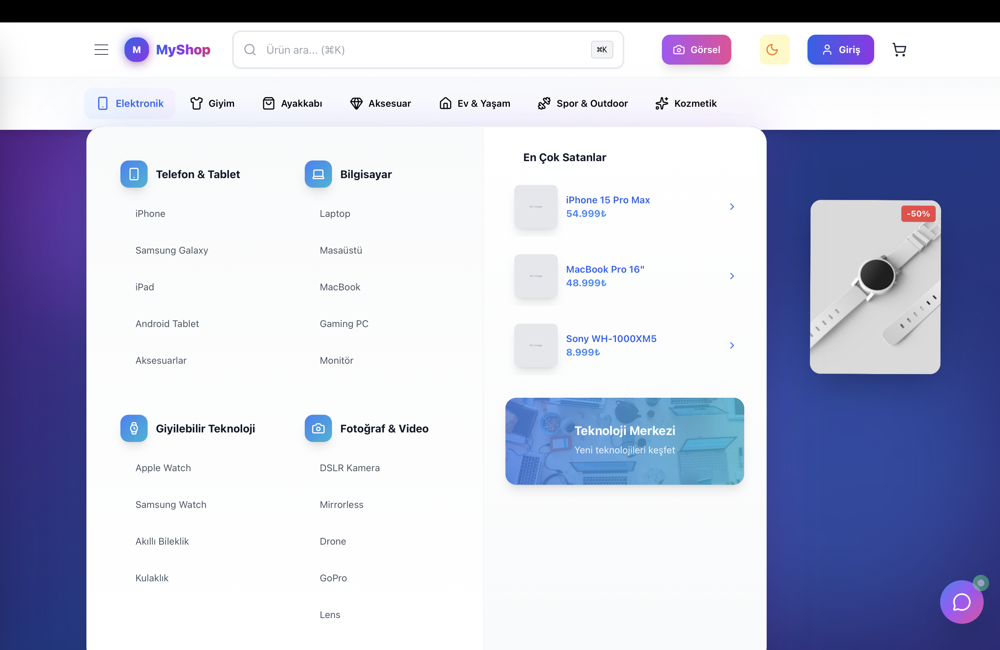</td>
    <td>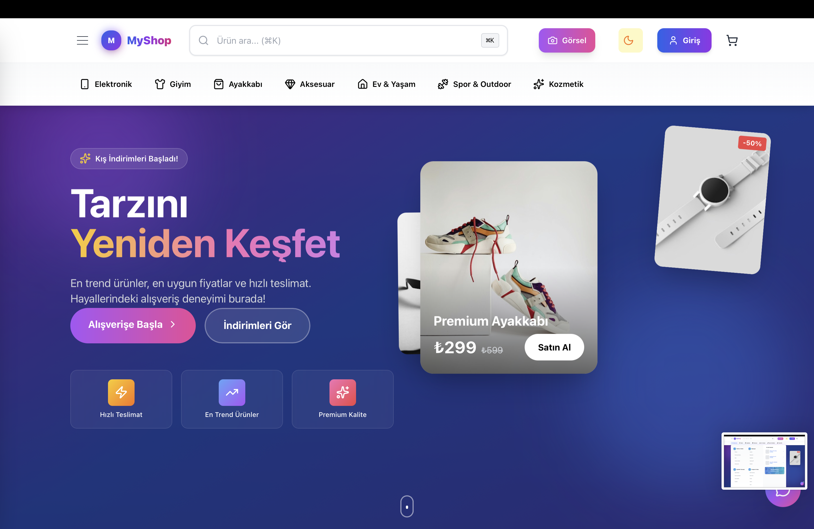</td>
  </tr>
  <tr>
    <td>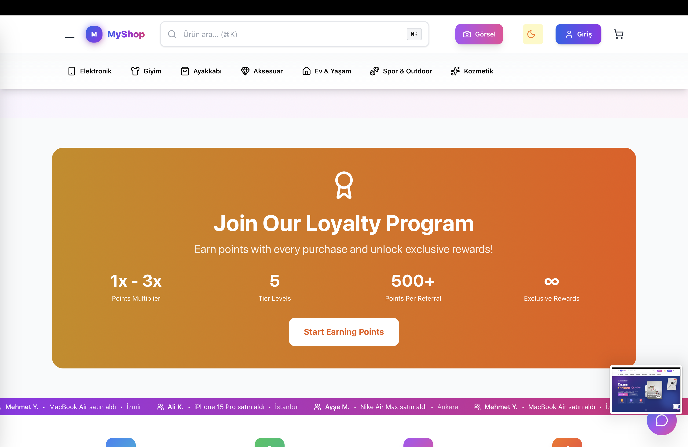</td>
    <td>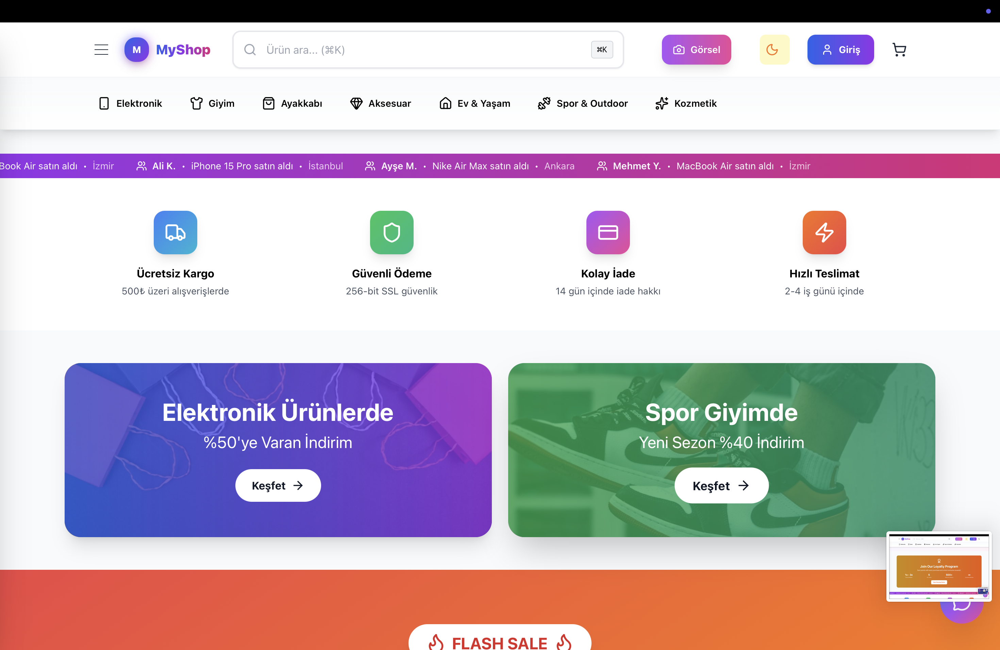</td>
  </tr>
  <tr>
    <td>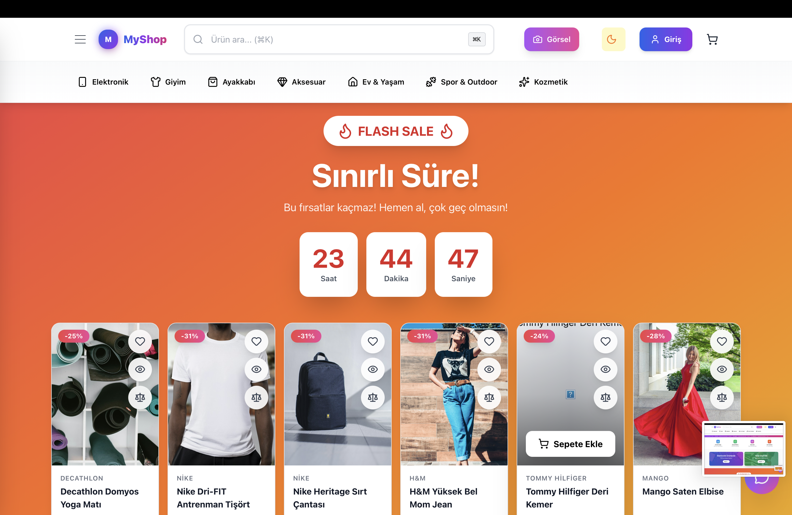</td>
    <td>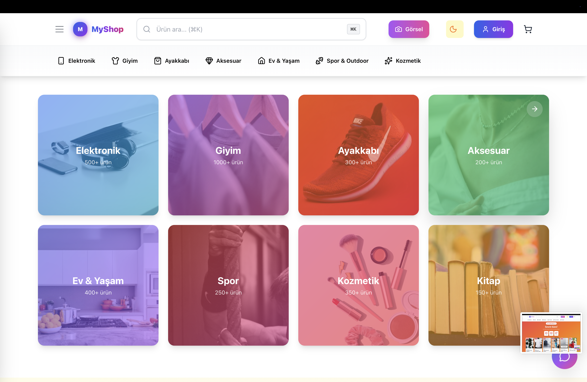</td>
  </tr>
  <tr>
    <td>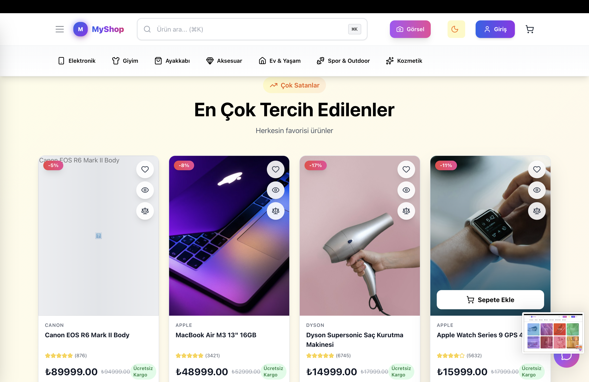</td>
    <td>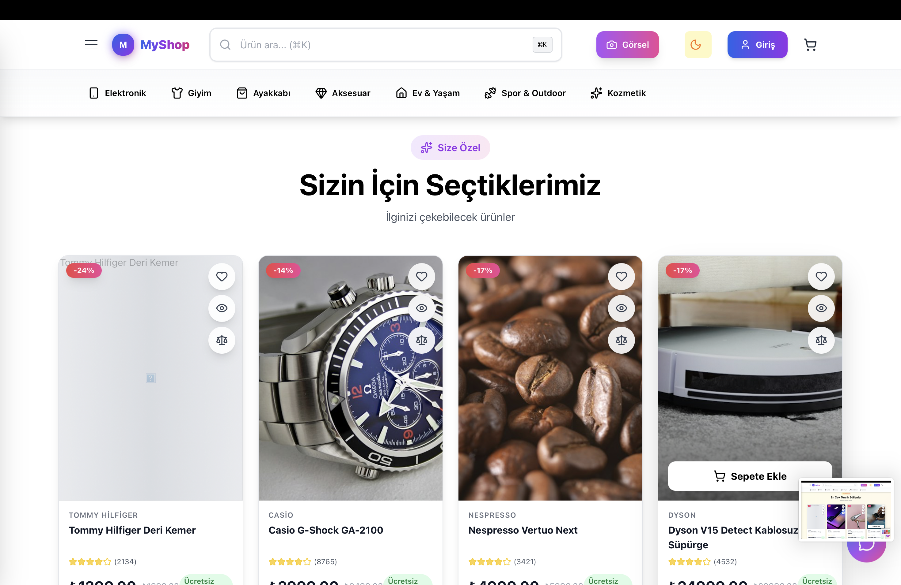</td>
  </tr>
  <tr>
    <td>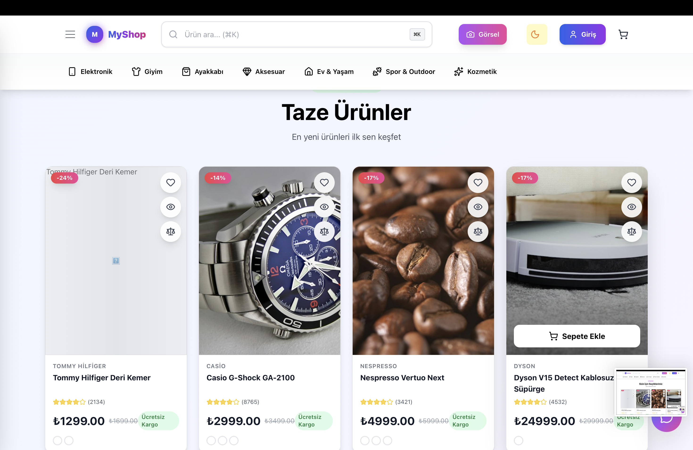</td>
    <td>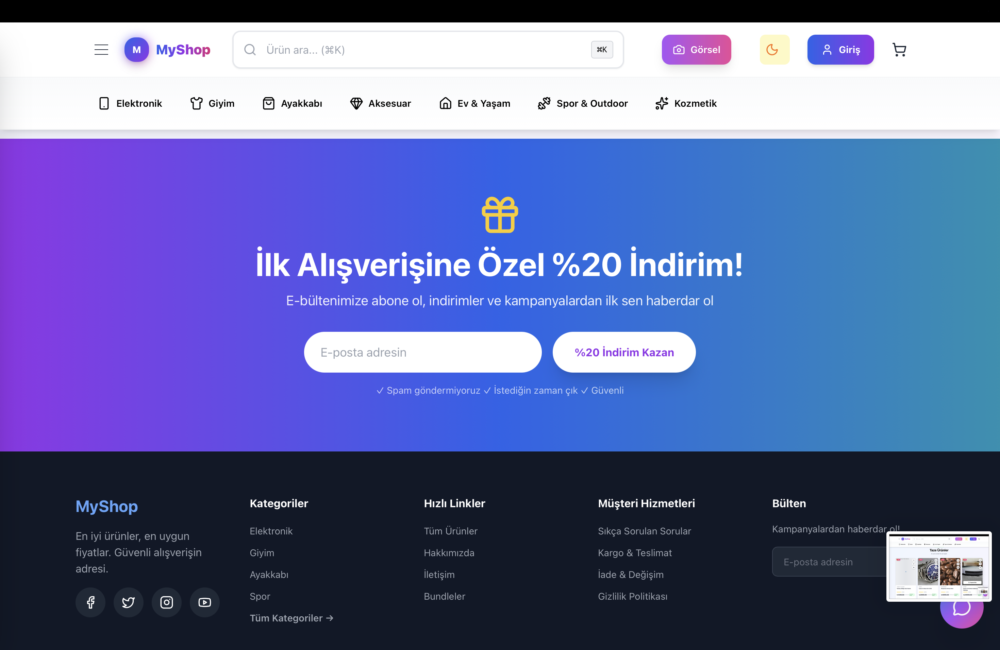</td>
  </tr>
  <tr>
    <td>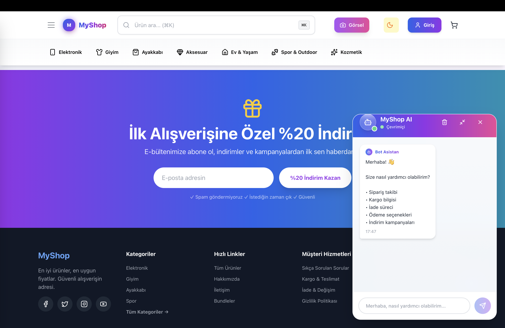</td>
    <td>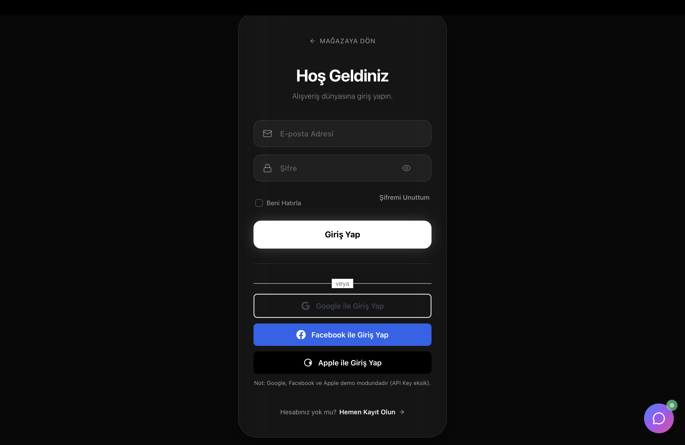</td>
  </tr>
  <tr>
    <td>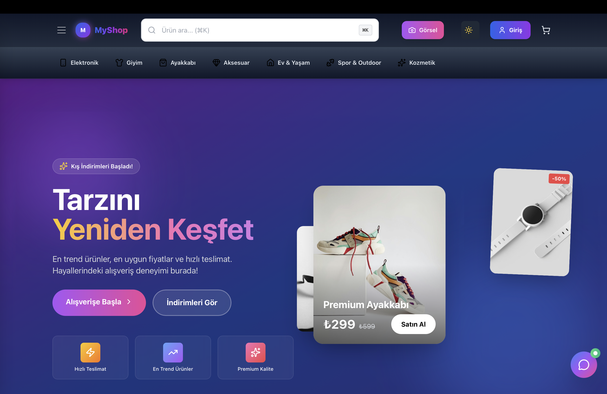</td>
    <td>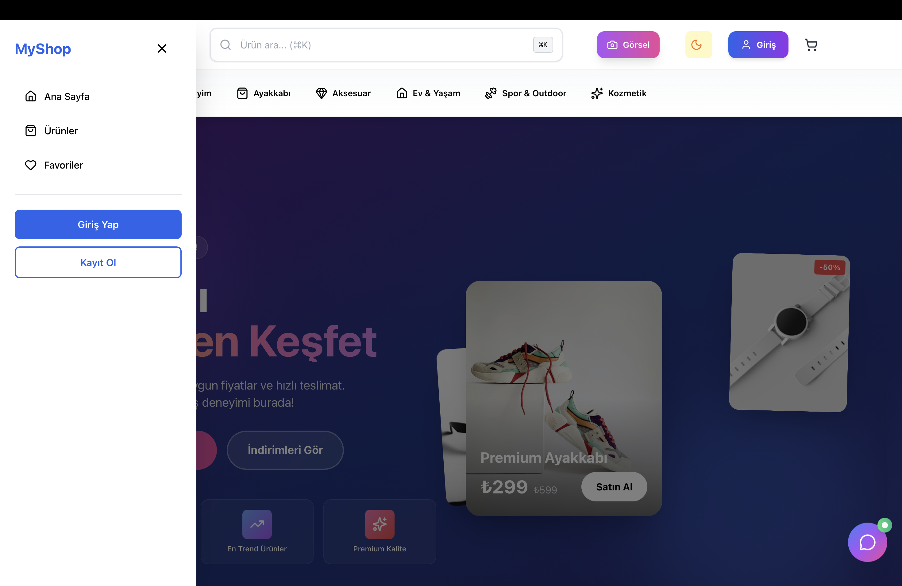</td>
  </tr>
</table>

## Tech Stack

### Frontend

- React 19 and React Router
- Vite
- Zustand for client state
- Tailwind CSS, Framer Motion and AOS
- Axios for API communication
- Recharts for analytics
- React Three Fiber and Three.js for interactive visuals

### Backend

- Node.js and Express 5
- MongoDB with Mongoose
- JWT and HTTP-only cookies for authentication
- Socket.IO for real-time communication
- Iyzico payment integration
- Nodemailer and Handlebars email templates
- Helmet, CORS, HPP and express-rate-limit

### Quality and delivery

- Jest and Supertest for backend tests
- Vitest and Testing Library for frontend tests
- ESLint
- Docker Compose
- Vercel/Render-ready deployment configuration

## Architecture

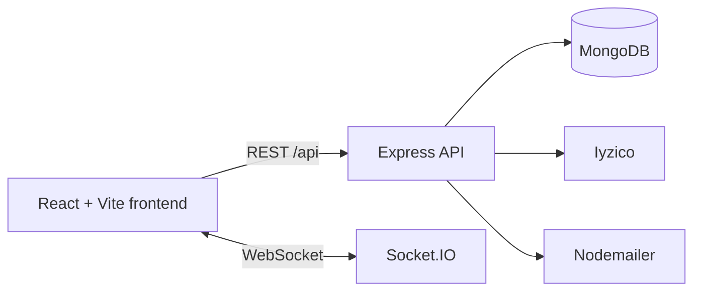

The frontend communicates with the backend through `/api`. During local development,
Vite proxies those requests to the Express server on port `5001`. The backend owns
authentication, business rules, validation and persistence.

## Project Structure

```text
.
├── backend/
│   ├── src/
│   │   ├── config/          # Database and application configuration
│   │   ├── controllers/     # Request and business-flow handlers
│   │   ├── middleware/      # Auth, security and error middleware
│   │   ├── models/          # Mongoose models
│   │   ├── routes/          # REST API routes
│   │   ├── services/        # Application services
│   │   └── server.js        # Express and Socket.IO entry point
│   └── package.json
├── frontend/
│   ├── src/
│   │   ├── api/             # API clients
│   │   ├── components/      # Reusable UI components
│   │   ├── pages/           # Route-level screens
│   │   ├── store/           # Zustand stores
│   │   └── main.jsx         # React entry point
│   └── package.json
├── docs/screenshots/         # README product screenshots
└── docker-compose.yml
```

## Getting Started

### Requirements

- Node.js 18 or newer
- npm
- MongoDB running locally or a MongoDB Atlas connection

### Environment configuration

Create or update:

- `backend/.env`
- `frontend/.env`

For local development, the important values are:

```env
# backend/.env
NODE_ENV=development
PORT=5001
MONGODB_URI=mongodb://127.0.0.1:27017/eticaret
CLIENT_URL=http://localhost:5178
JWT_SECRET=replace-with-a-long-local-secret
```

```env
# frontend/.env
VITE_API_URL=/api
```

Never commit real passwords, JWT secrets, payment credentials or SMTP credentials.

### Install dependencies

```bash
npm install
npm --prefix backend install
npm --prefix frontend install
```

### Run frontend and backend together

From the repository root:

```bash
npm run dev
```

Local URLs:

- Frontend: http://127.0.0.1:5178
- Backend: http://localhost:5001
- Health check: http://localhost:5001/api/health

If port `5178` is already in use, Vite automatically selects the next available
port. The terminal output is the source of truth for the frontend URL.

### Run services separately

```bash
# Backend
npm --prefix backend run dev

# Frontend
npm --prefix frontend run dev
```

## Useful Commands

```bash
# Backend
npm --prefix backend start
npm --prefix backend run seed
npm --prefix backend test

# Frontend
npm --prefix frontend run build
npm --prefix frontend run lint
npm --prefix frontend test
```

## Deployment

The application can be deployed as separate services:

1. Provision MongoDB Atlas and create the required database user.
2. Deploy `backend/` as a Node.js web service.
3. Configure backend environment variables, including `MONGODB_URI`,
   `JWT_SECRET`, `CLIENT_URL` and payment/email credentials.
4. Build and deploy `frontend/` with `VITE_API_URL` pointing to the backend API.
5. Verify the deployment through `/api/health`.

Detailed production instructions are available in
[`PRODUCTION_DEPLOYMENT.md`](./PRODUCTION_DEPLOYMENT.md).

## Security Notes

- Keep all `.env` files out of version control.
- Use separate credentials for development and production.
- Restrict MongoDB Atlas network access where possible.
- Use HTTPS and strong secrets in production.
- Configure payment and SMTP credentials only through the deployment platform.

## Roadmap

- Add richer API documentation with OpenAPI
- Expand automated end-to-end coverage
- Improve observability with structured logs and metrics
- Add further personalization and recommendation capabilities

## Author

**Dogukan Bayar**

- GitHub: [dogu08](https://github.com/dogu08)
- Repository: [eticaret-projesi](https://github.com/dogu08/eticaret-projesi)

## License

This project is licensed under the MIT License.
